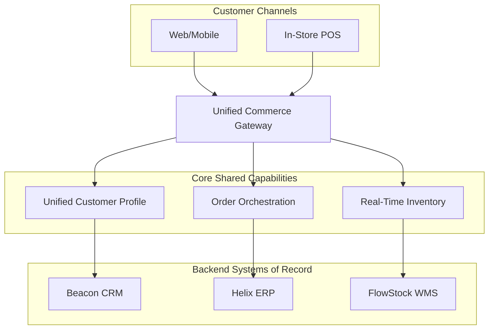

# Solution Concept Diagram

*Demo data for Meridian Retail Group (fictitious company).*

## Purpose

Gives an early, high-level sketch of how the Unified Commerce Platform will
be structured, before detailed business/data/application/technology work
begins.

## Diagram

## Notes

- This is a conceptual sketch only; detailed structure is elaborated in the
  domain-specific diagrams (e.g.
  [[04-application-architecture/diagrams/application-communication-diagram]]).
