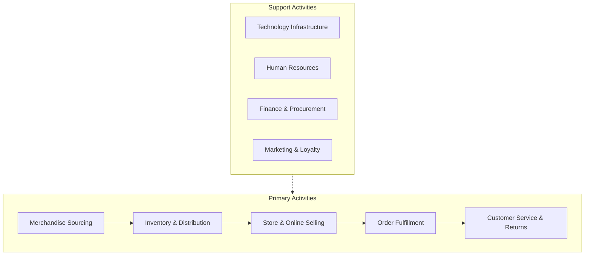

# Value Chain Diagram

*Demo data for Meridian Retail Group (fictitious company).*

## Purpose

Shows MRG's primary and support activities, to identify where the Unified
Commerce Platform creates competitive differentiation.

## Diagram

## Notes

- P3 and P4 are the focus of the Unified Commerce Platform program (see
  [[01-architecture-vision/architecture-vision]]); S4 (Marketing & Loyalty)
  is the secondary focus via customer profile consolidation.
