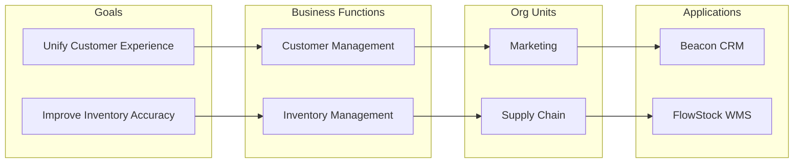

# Business Footprint Diagram

*Demo data for Meridian Retail Group (fictitious company).*

## Purpose

Maps business goals to the functions, organizational units, and applications
that realize them, showing the "footprint" of each goal across the business.

## Diagram

## Notes

- Goals correspond to the drivers listed in
  [[01-architecture-vision/architecture-vision]].
- FlowStock WMS is the SBB-03 selection from
  [[06-opportunities-and-solutions/solution-building-blocks-catalog]].
