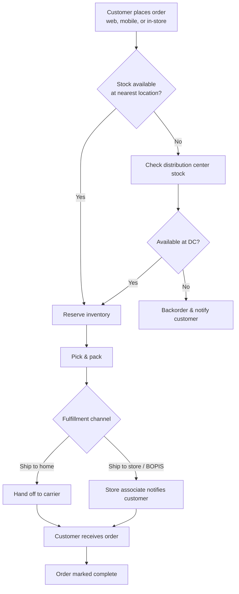

# Order-to-Fulfillment Process Flow Diagram

*Demo data for Meridian Retail Group (fictitious company).*

## Purpose

Shows the end-to-end flow of a customer order from placement through
fulfillment, across the channels and org units involved.

## Diagram

## Notes

- "BOPIS" = Buy Online, Pickup In Store.
- Corresponds to services BF-01 through BF-04 in
  [[02-business-architecture/catalogs/business-service-function-catalog]].
