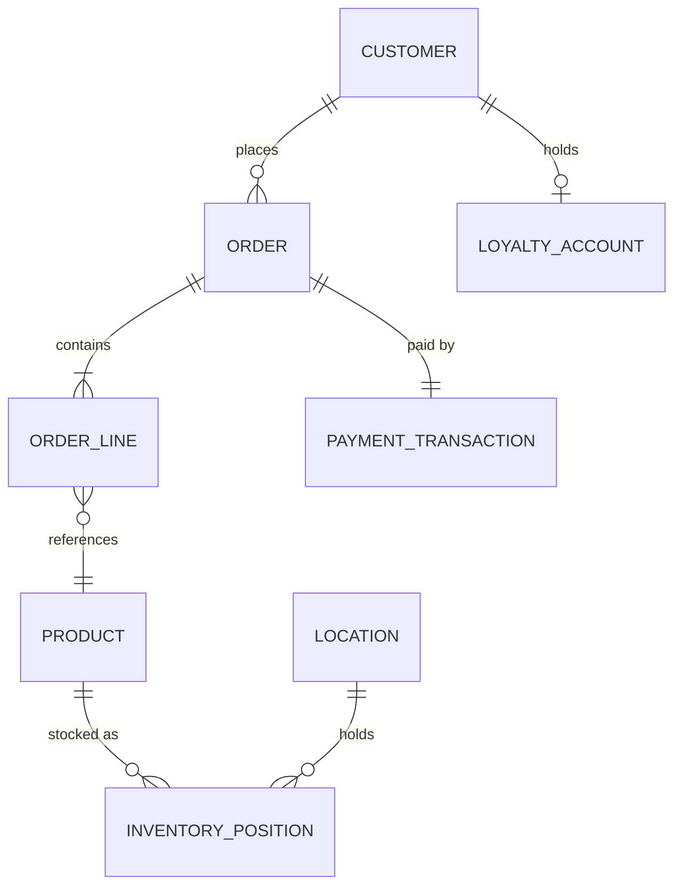

# Core Data Entity Relationship Diagram

*Demo data for Meridian Retail Group (fictitious company).*

## Purpose

Shows the relationships between MRG's core data entities.

## Diagram

## Notes

- Matches entities defined in [[03-data-architecture/catalogs/data-entity-catalog]].
- ORDER_LINE is a decomposition of Order (DE-02) not separately catalogued.
