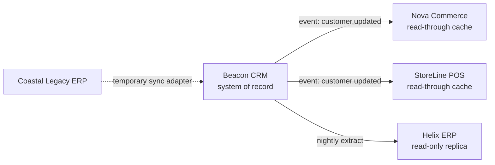

# Data Dissemination Diagram

*Demo data for Meridian Retail Group (fictitious company).*

## Purpose

Shows how the Customer entity is distributed and replicated across
applications and locations.

## Diagram

## Notes

- Nova Commerce and StoreLine POS hold no independent copy of Customer data;
  they cache reads only, consistent with
  [[04-application-architecture/matrices/application-data-matrix]].
- The Coastal Legacy ERP feed is temporary; see RISK-01 in
  [[11-risk-and-security/risk-register]].
