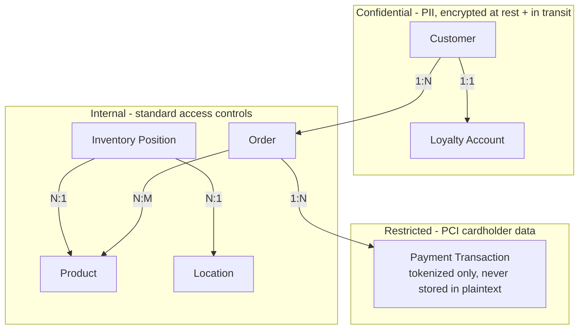

# Data Security Diagram

*Demo data for Meridian Retail Group (fictitious company).*

## Purpose

Shows the classification and protection requirement for each core data
entity in [[03-data-architecture/catalogs/data-entity-catalog]], distinct
from the network trust-zone view in
[[11-risk-and-security/security-architecture-diagram]].

## Diagram

## Notes

- Payment Transaction is tokenized at capture by InsightPay Gateway per
  PRIN-05 in [[00-preliminary/architecture-principles-catalog]]; the
  Restricted zone here is a data-classification scope, narrower than the
  PCI-DSS Scoped Zone network boundary in
  [[11-risk-and-security/security-architecture-diagram]].
- Customer and Loyalty Account classification as Confidential is the basis
  for the encryption requirement called out against RISK-01 in
  [[11-risk-and-security/risk-register]] during the Coastal Legacy ERP sync.
