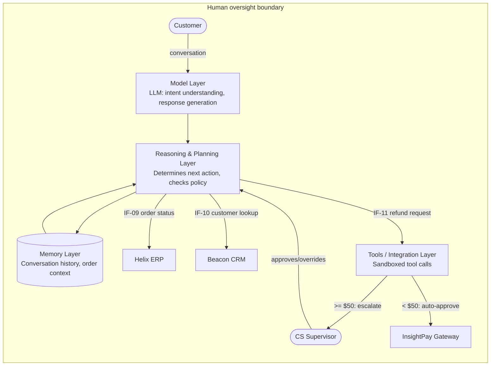

# AI Agent Architecture Diagram: Atlas Support Agent

*Demo data for Meridian Retail Group (fictitious company).*

## Purpose

Shows the internal layered architecture of Atlas Support Agent (APP-08), a
pilot LLM-based agent that assists customers with order-support
conversations. Complements the
[[04-application-architecture/diagrams/application-communication-diagram]]
(which shows Atlas as one node among MRG's applications) by opening up that
node into its constituent layers, and gives the Architecture Review Board a
shared blueprint for evaluating the pilot before it moves beyond "Piloting"
status.

## Diagram

## Notes

- **Model layer**: hosted LLM; no direct write access to any MRG system —
  all actions pass through the Planning layer's policy check first.
- **Reasoning & Planning layer**: evaluates the conversation goal, selects
  the next tool call, and enforces the authorization thresholds defined in
  [[04-application-architecture/matrices/ai-agent-responsibility-matrix]].
- **Tools/Integration layer**: the only layer with outbound access to MRG
  systems; every call is sandboxed and read-only except refund issuance
  (IF-11), which is threshold-gated per the responsibility matrix.
- **Memory layer**: scoped to the active conversation plus recent order
  history; retention and access are tracked as risk RISK-06 in
  [[11-risk-and-security/risk-register]].
- **Human oversight boundary**: a CS Supervisor can override any Planning
  decision and must approve refunds at or above $50; this boundary is the
  control MRG's Architecture Review Board reviews before promoting Atlas
  out of "Piloting" status.
- Interfaces IF-09, IF-10, IF-11 are cataloged in
  [[04-application-architecture/catalogs/interface-catalog]].
