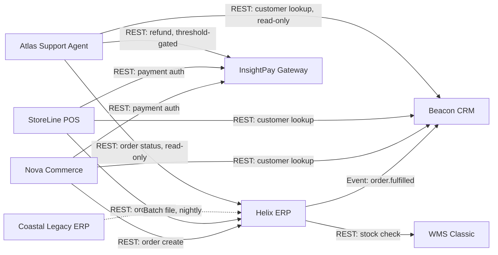

# Application Communication Diagram

*Demo data for Meridian Retail Group (fictitious company).*

## Purpose

Shows the integration interfaces between MRG's core applications.

## Diagram

## Notes

- Dashed edge indicates a legacy batch interface slated for decommission
  alongside Coastal Legacy ERP retirement.
- Atlas Support Agent's edges (IF-09, IF-10, IF-11) are sandboxed tool calls,
  not direct human-initiated traffic; see
  [[04-application-architecture/diagrams/ai-agent-architecture-diagram]] for
  its internal architecture.
- Corresponds to relationships implied in
  [[04-application-architecture/matrices/application-function-matrix]].
