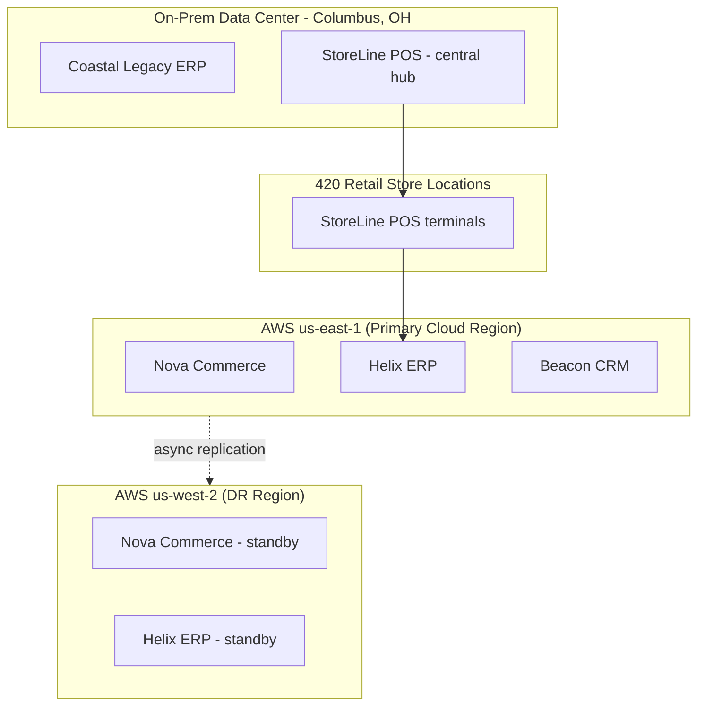

# Environments and Locations Diagram

*Demo data for Meridian Retail Group (fictitious company).*

## Purpose

Shows physical/cloud hosting locations and which applications run where.

## Diagram

## Notes

- DR region is warm-standby only; failover is manual, tracked as a gap in
  [[06-opportunities-and-solutions/gap-analysis]].
- Columbus on-prem data center is slated for exit per PRIN-04 in
  [[00-preliminary/architecture-principles-catalog]].
