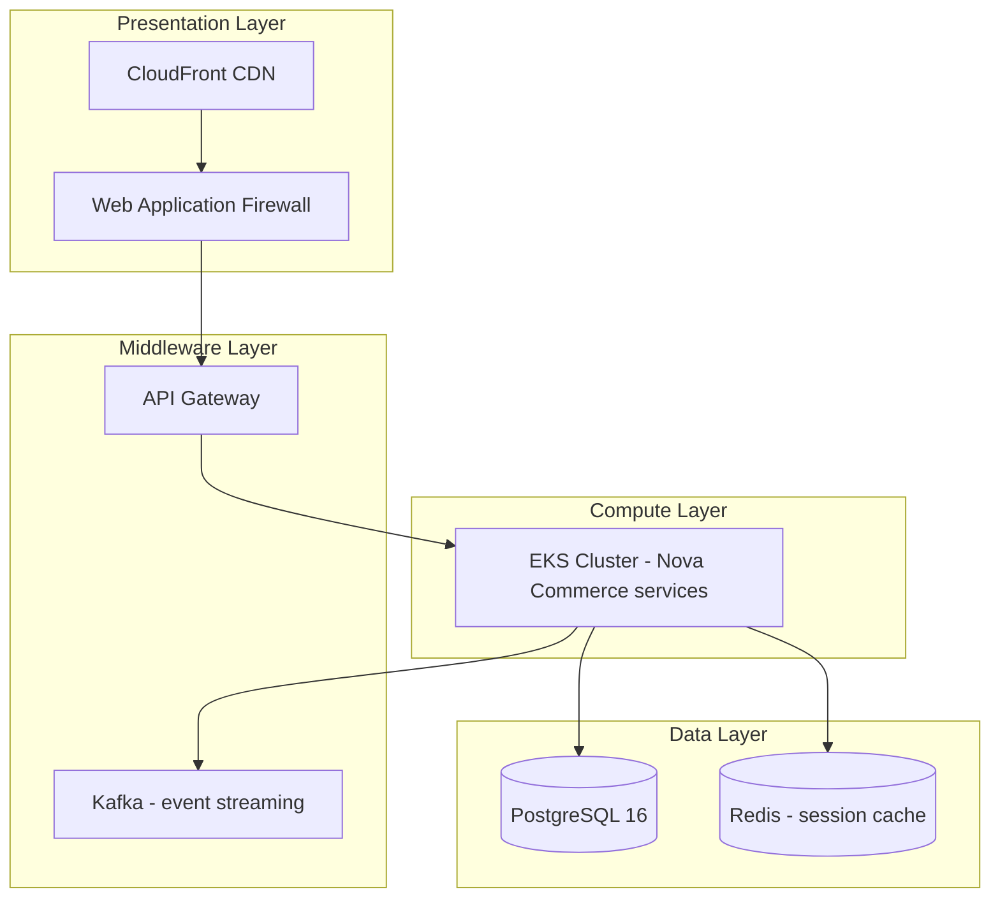

# Platform Decomposition Diagram

*Demo data for Meridian Retail Group (fictitious company).*

## Purpose

Breaks down the technology platform supporting Nova Commerce into its
constituent layers.

## Diagram

## Notes

- All layers run on TS-01/TS-02/TS-03/TS-04 standards from
  [[05-technology-architecture/catalogs/technology-standards-catalog]].
