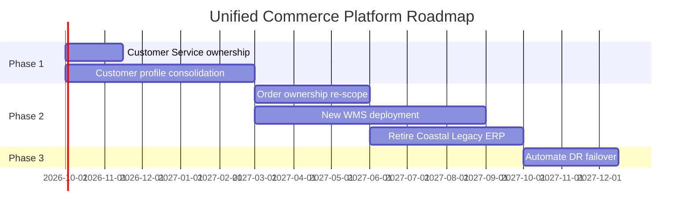

# Implementation and Migration Plan: Unified Commerce Platform

*Demo data for Meridian Retail Group (fictitious company).*

## Purpose

Sequences the work packages needed to close the gaps identified in
[[06-opportunities-and-solutions/gap-analysis]] into phased delivery.

## Work Packages

| ID | Work Package | Closes Gap(s) | Phase | Start | End | Dependency |
|----|---------------|----------------|-------|-------|-----|------------|
| WP-01 | Define Customer Service ownership model | G-01 | 1 | 2026-10-01 | 2026-11-15 | None |
| WP-02 | Consolidate customer profile into Beacon CRM | G-02 | 1 | 2026-10-01 | 2027-02-28 | None |
| WP-03 | Re-scope Nova Commerce / Helix ERP order ownership | G-03 | 2 | 2027-03-01 | 2027-05-31 | WP-02 |
| WP-04 | Select and deploy new WMS | G-04 | 2 | 2027-03-01 | 2027-08-31 | None |
| WP-05 | Retire Coastal Legacy ERP | G-06 | 2 | 2027-06-01 | 2027-09-30 | WP-03 |
| WP-06 | Automate AWS DR failover | G-05 | 3 | 2027-10-01 | 2027-12-15 | None |

## Roadmap

## Notes

- Phase boundaries align with store rollout constraint of 40 stores/month
  noted in [[01-architecture-vision/architecture-vision]].
- Compliance checkpoints for each phase are defined in
  [[08-implementation-governance/architecture-compliance-assessment]].
- The architecture state at the end of each phase is described in
  [[07-migration-planning/transition-architecture]].
