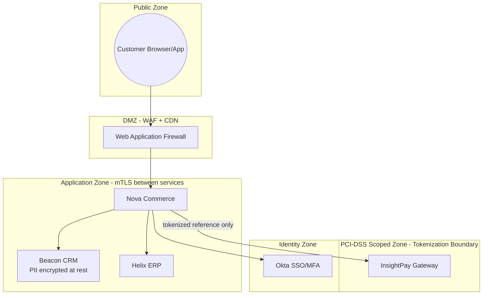

# Security Architecture Diagram: Payment & Customer Data Zones

*Demo data for Meridian Retail Group (fictitious company).*

## Purpose

Shows the trust zones and controls protecting cardholder and customer data
across the commerce platform.

## Diagram

## Notes

- No raw cardholder data crosses out of the PCI-DSS Scoped Zone, satisfying
  PRIN-05 in [[00-preliminary/architecture-principles-catalog]].
- RISK-01 in [[11-risk-and-security/risk-register]] concerns a temporary
  exception to this boundary during the Coastal Legacy ERP migration.
