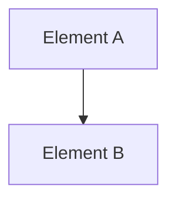

# <Diagram Name>

## Purpose

What this diagram shows and who it's for.

## Diagram

```mermaid
flowchart TD
  A[Element A] --> B[Element B]
```

## Notes

- Key elements and what they represent.
- Related catalogs/matrices this diagram is derived from.
