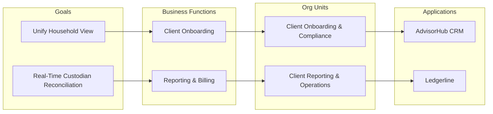

# Business Footprint Diagram

*Demo data for Silverline Private Wealth (fictitious company).*

## Purpose

Maps business goals to the functions, organizational units, and
applications that realize them, showing the "footprint" of each goal across
the firm.

## Diagram

## Notes

- Goals correspond to the drivers listed in
  [[01-architecture-vision/architecture-vision]].
- Ledgerline's reconciliation module is the PW-SBB-03 selection from
  [[06-opportunities-and-solutions/solution-building-blocks-catalog]].
