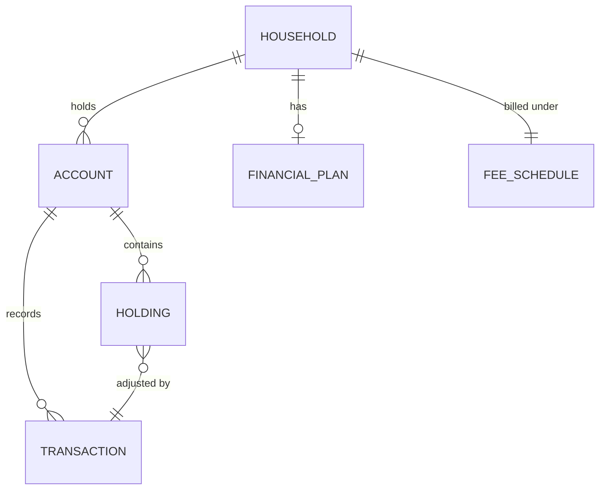

# Core Data Entity Relationship Diagram

*Demo data for Silverline Private Wealth (fictitious company).*

## Purpose

Shows the relationships between SPW's core data entities.

## Diagram

## Notes

- Matches entities defined in
  [[03-data-architecture/catalogs/data-entity-catalog]].
- Every Account belongs to exactly one Household, the basis for
  [[06-opportunities-and-solutions/gap-analysis]] gap G-02 (households
  currently split across two systems have two conflicting Account sets).
