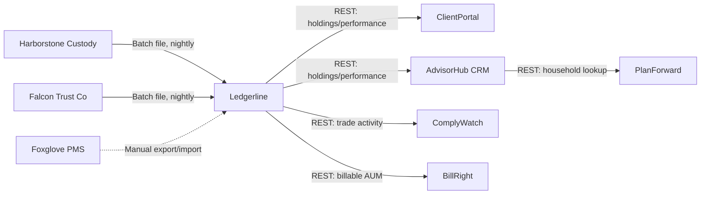

# Application Communication Diagram

*Demo data for Silverline Private Wealth (fictitious company).*

## Purpose

Shows the integration interfaces between SPW's core applications and
external custodians.

## Diagram

## Notes

- Dashed edge indicates the temporary, manual migration path for Birchwood
  households, slated for decommission alongside Foxglove PMS retirement.
- Corresponds to relationships implied in
  [[04-application-architecture/matrices/application-function-matrix]].
