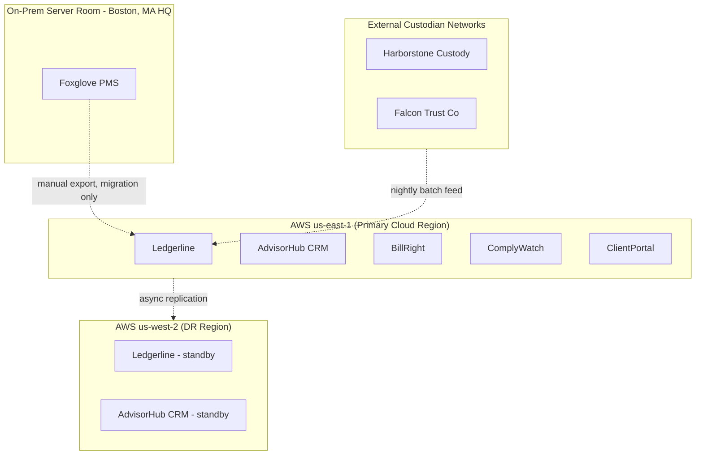

# Environments and Locations Diagram

*Demo data for Silverline Private Wealth (fictitious company).*

## Purpose

Shows physical/cloud hosting locations and which applications run where.

## Diagram

## Notes

- DR region is warm-standby only; failover is manual, tracked as an accepted
  risk in [[11-risk-and-security/risk-register]].
- The Boston on-prem server room is slated for exit per PW-PRIN-04 in
  [[00-preliminary/architecture-principles-catalog]], once Foxglove PMS
  retires.
