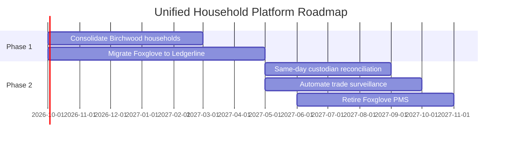

# Implementation and Migration Plan: Unified Household Platform

*Demo data for Silverline Private Wealth (fictitious company).*

## Purpose

Sequences the work packages needed to close the gaps identified in
[[06-opportunities-and-solutions/gap-analysis]] into phased delivery.

## Work Packages

| ID | Work Package | Closes Gap(s) | Phase | Start | End | Dependency |
|----|---------------|----------------|-------|-------|-----|------------|
| WP-01 | Consolidate Birchwood households into AdvisorHub CRM | G-01 | 1 | 2026-10-01 | 2027-02-28 | None |
| WP-02 | Migrate Birchwood households from Foxglove PMS to Ledgerline | G-02, G-03 | 1 | 2026-10-01 | 2027-04-30 | None (runs in parallel with WP-01) |
| WP-03 | Implement same-day custodian reconciliation | G-04 | 2 | 2027-05-01 | 2027-08-31 | None |
| WP-04 | Automate real-time trade surveillance alerts in ComplyWatch | G-06 | 2 | 2027-05-01 | 2027-09-30 | None |
| WP-05 | Retire Foxglove PMS | G-05 | 2 | 2027-06-01 | 2027-10-31 | WP-02 |

## Roadmap

## Notes

- Phase boundaries respect the constraint that advisor-facing systems must
  have zero downtime during trading hours, noted in
  [[01-architecture-vision/architecture-vision]].
- Compliance checkpoints for each phase are defined in
  [[08-implementation-governance/architecture-compliance-assessment]].
